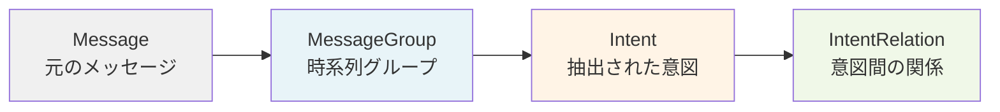
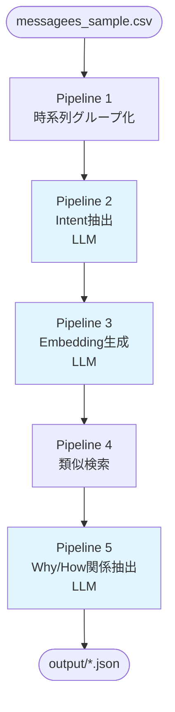

# Data API - 検証プログラム設計

## 1. 目的

メッセージデータから意図（Intent: 「〜したい」という目的）を抽出し、時系列・意味的類似度・因果関係で関連性を分析する処理フローを検証する。

---

## 2. 使用技術

### Gemini API

本プロジェクトではGoogle Gemini APIを使用してLLM処理を実行します。

#### 使用モデル（2025年11月時点）

| 用途 | モデルID | 特徴 |
|------|----------|------|
| テキスト生成<br/>（Intent抽出、関係抽出） | `gemini-2.5-flash` | 価格とパフォーマンスのバランスが最良<br/>大規模処理・低レイテンシに最適 |
| 埋め込みベクトル生成 | `gemini-embedding-001` | 768次元（推奨）<br/>100言語以上対応<br/>入力制限: 2,048トークン |

#### API動作確認済み

```bash
# テスト実行
uv run python scripts/test_gemini_api.py
```

**確認内容**:
- ✓ Gemini 2.5 Flash によるテキスト生成（日本語プロンプト対応）
- ✓ Gemini Embedding による768次元ベクトル生成

#### 活用方針

**Pipeline 2 (Intent抽出)**:
- モデル: `gemini-2.5-flash`
- 用途: メッセージグループから意図を抽出
- プロンプト: 構造化出力（JSON形式）

**Pipeline 3 (Embedding生成)**:
- モデル: `gemini-embedding-001`
- 出力次元: 768（推奨値）
- タスクタイプ: `retrieval_document`

**Pipeline 5 (Why/How関係抽出)**:
- モデル: `gemini-2.5-flash`
- 用途: Intent間の因果関係を分析
- プロンプト: 構造化出力（JSON形式）

#### 環境設定

```bash
# .env ファイルに API キーを設定
GEMINI_API_KEY=your_api_key_here

# 依存パッケージ
uv add google-generativeai python-dotenv
```

---

## 3. データモデル



### Message

```python
{
  "id": "2",
  "timestamp": "2025-09-21T23:15:24",
  "text": "直近使ってたラインの一覧という形で構造無視してリスト出すと便利そう。...",
  "message_type": "text"
}
```

### MessageGroup

```python
{
  "id": "group_001",
  "message_ids": ["2", "3", "4"],
  "start_time": "2025-09-21T23:15:24",
  "end_time": "2025-09-21T23:28:40"
}
```

### Intent

```python
{
  "id": "group_001_intent_0",
  "group_id": "group_001",
  "summary": "フッターUIからラインを切り替える機能を実装したい",
  "embedding": [0.123, -0.456, ...]  # 768次元
}
```

### IntentRelation

```python
{
  "source_intent_id": "group_005_intent_0",
  "target_intent_id": "group_002_intent_0",
  "relation_type": "why"  # または "how"
}
```

---

## 4. 処理フロー



### Pipeline 1: 時系列グループ化

**入力**: メッセージリスト、時間閾値（分）

**処理**:
1. タイムスタンプでソート
2. 隣接メッセージ間の時間差を計算
3. 時間差 ≤ 閾値 → 同一グループ
4. 時間差 > 閾値 → 新規グループ

**出力**: MessageGroup のリスト

### Pipeline 2: Intent抽出（LLM）

**入力**: MessageGroup、メッセージ本文

**LLMプロンプト**:
```
以下のメッセージグループから、ユーザーが「〜したい」という意図を抽出してください。

# メッセージ群
[2025-09-21 23:15:24] (text)
直近使ってたラインの一覧という形で構造無視してリスト出すと便利そう。
...

# 出力形式（JSON配列）
[
  {"summary": "フッターUIからラインを切り替える機能を実装したい"}
]
```

**出力**: Intent のリスト

### Pipeline 3: Embedding生成（LLM）

**入力**: Intent

**処理**: LLM Embedding APIでsummaryをベクトル化

**出力**: Intent（embeddingフィールド付与）

### Pipeline 4: 類似Intent検索

**入力**: Intent ID、N（時系列件数）、M（類似度件数）

**処理**:
1. 時系列検索: 作成時刻が近いN個
2. 類似度検索: コサイン類似度が高いM個
3. 結果をマージ

**出力**: 関連IntentのIDリスト

### Pipeline 5: Why/How関係抽出（LLM）

**入力**: ソースIntent、候補Intentリスト

**LLMプロンプト**:
```
# ソースIntent
"メッセージ編集UIの改善を実装したい"

# 候補Intents
1. "編集ボタンがテキストに被って見づらい問題を解決したい"
2. "メッセージ右下のバッチを下にずらしたい"

# タスク
候補の中から、ソースIntentに対する関係を判定：
- Why: ソースの背景・理由
- How: ソースの実現手段

# 出力形式（JSON）
{
  "why_relations": ["1"],
  "how_relations": ["2"]
}
```

**出力**: IntentRelation のリスト

---

## 5. プログラム構成

### エントリーポイント

```bash
python main.py \
  --input messagees_sample.csv \
  --pipelines 1,2,3,4,5 \
  --output output/
```

### 内部構造

```python
# main.py
def main(input_file, pipelines, output_dir):
    if "1" in pipelines:
        groups = run_pipeline1(input_file)
        save_json(groups, f"{output_dir}/groups.json")

    if "2" in pipelines:
        intents = run_pipeline2(groups)
        save_json(intents, f"{output_dir}/intents.json")

    if "3" in pipelines:
        intents = run_pipeline3(intents)
        save_json(intents, f"{output_dir}/intents_embedded.json")

    if "4" in pipelines:
        similar = run_pipeline4(intents, intent_id, n, m)
        save_json(similar, f"{output_dir}/similar.json")

    if "5" in pipelines:
        relations = run_pipeline5(intents, similar)
        save_json(relations, f"{output_dir}/relations.json")
```

### 将来的なAPI化

```python
# 各pipelineは独立した関数として実装
# → FastAPIエンドポイントから直接呼び出し可能

@app.post("/api/pipeline1")
def api_pipeline1(messages):
    return run_pipeline1(messages)

@app.post("/api/pipeline2")
def api_pipeline2(groups):
    return run_pipeline2(groups)
```

---

## 6. 期待される出力

### Pipeline 1: groups.json

```json
[
  {
    "id": "group_001",
    "message_ids": ["2", "3", "4"],
    "start_time": "2025-09-21T23:15:24",
    "end_time": "2025-09-21T23:28:40"
  }
]
```

### Pipeline 2: intents.json

```json
[
  {
    "id": "group_001_intent_0",
    "group_id": "group_001",
    "summary": "フッターUIからラインを切り替える機能を実装したい",
    "embedding": null
  }
]
```

### Pipeline 3: intents_embedded.json

```json
[
  {
    "id": "group_001_intent_0",
    "group_id": "group_001",
    "summary": "フッターUIからラインを切り替える機能を実装したい",
    "embedding": [0.123, -0.456, ...]
  }
]
```

### Pipeline 4: similar.json

```json
{
  "source_intent_id": "group_005_intent_0",
  "temporal_neighbors": ["group_004_intent_1", "group_006_intent_0"],
  "similarity_neighbors": ["group_012_intent_0", "group_023_intent_1"]
}
```

### Pipeline 5: relations.json

```json
[
  {
    "source_intent_id": "group_005_intent_0",
    "target_intent_id": "group_002_intent_0",
    "relation_type": "why"
  },
  {
    "source_intent_id": "group_005_intent_0",
    "target_intent_id": "group_003_intent_1",
    "relation_type": "how"
  }
]
```

---

## 7. 実行例

### 全パイプライン実行

```bash
python main.py \
  --input messagees_sample.csv \
  --pipelines 1,2,3,4,5 \
  --threshold 30 \
  --n_temporal 5 \
  --m_similarity 5 \
  --output output/
```

### 特定パイプラインのみ実行

```bash
# Pipeline 1のみ
python main.py --input messagees_sample.csv --pipelines 1 --output output/

# Pipeline 2-3のみ（グループ化済みを前提）
python main.py --pipelines 2,3 --groups output/groups.json --output output/
```

---

## 8. 用語定義

| 用語 | 定義 |
|------|------|
| Intent | メッセージから抽出された「〜したい」という意図・目的 |
| Why関係 | あるIntentの背景・理由となる別のIntent |
| How関係 | あるIntentの実現手段となる別のIntent |
